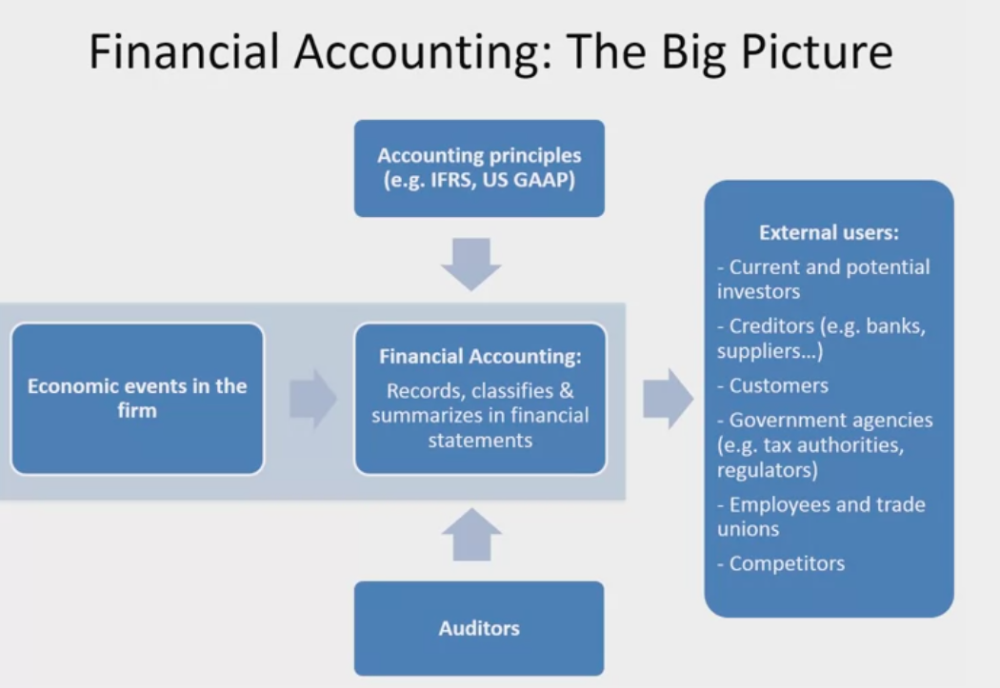
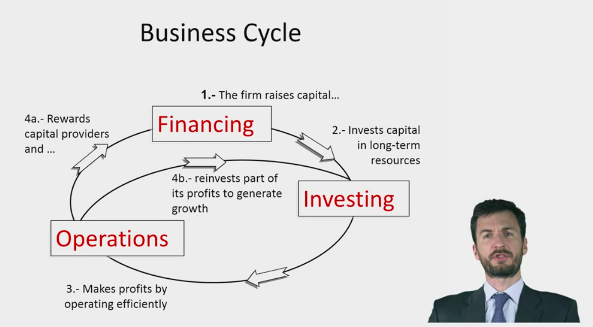
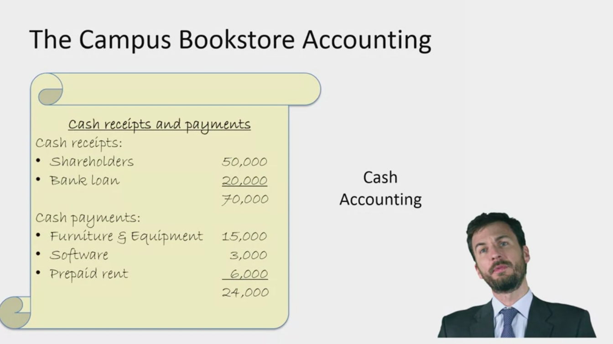
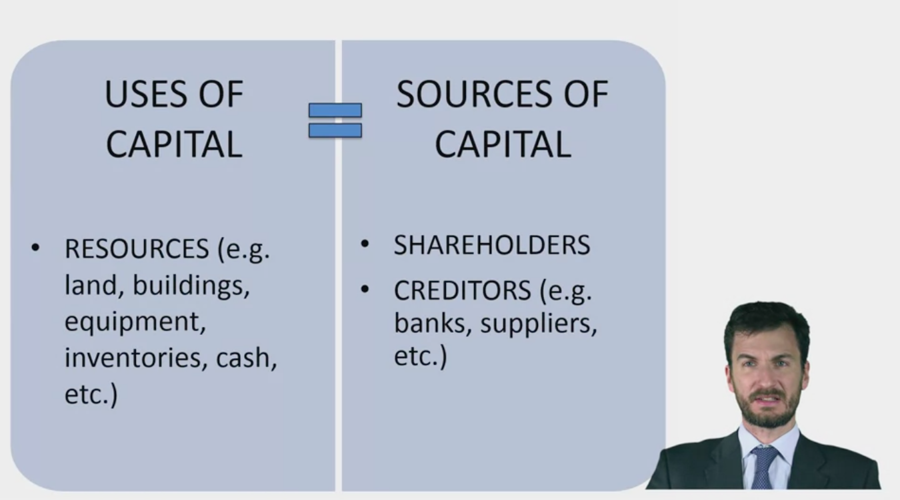
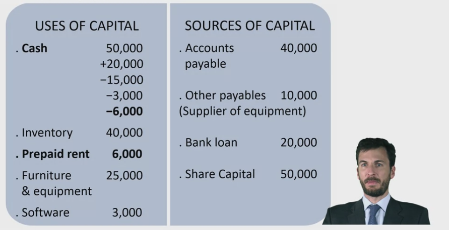
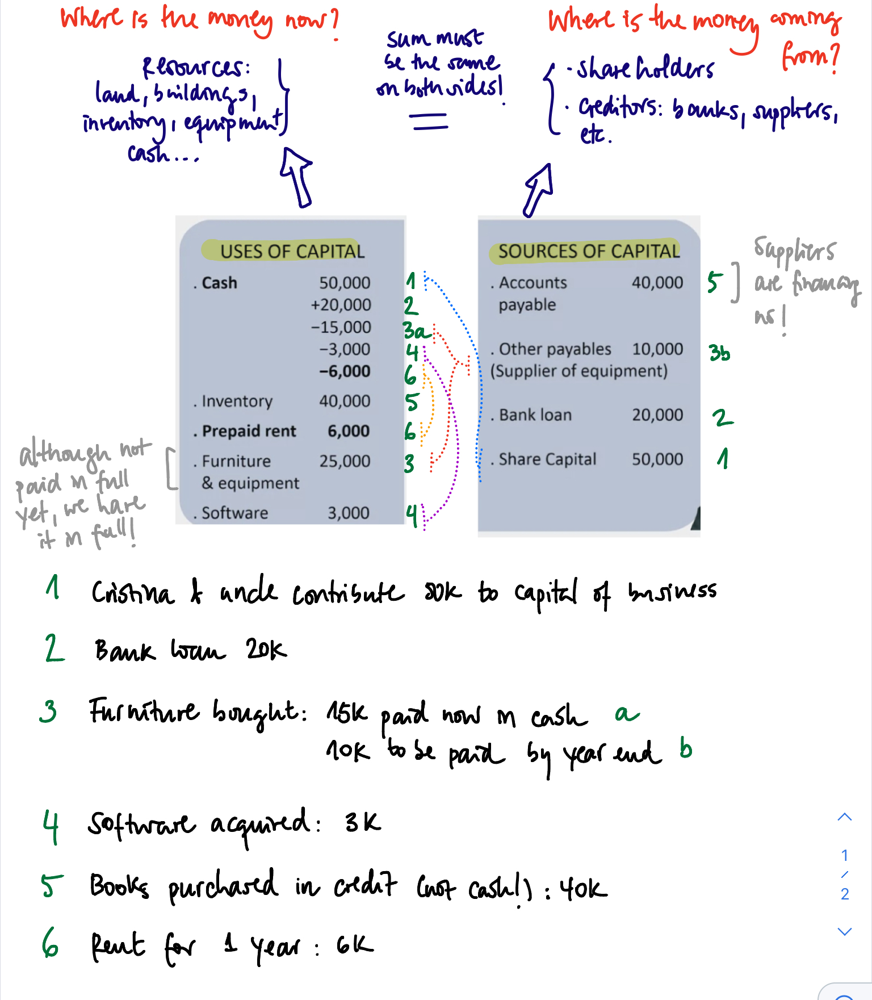
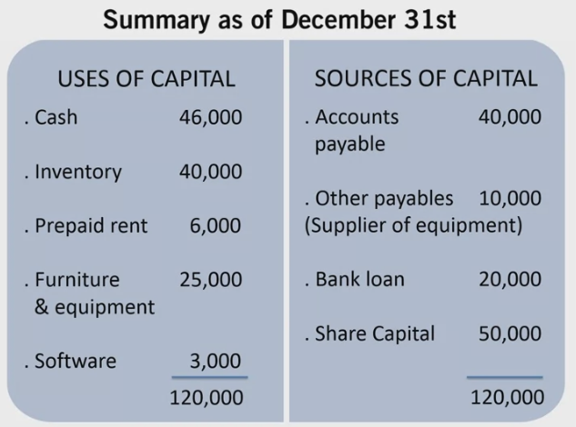
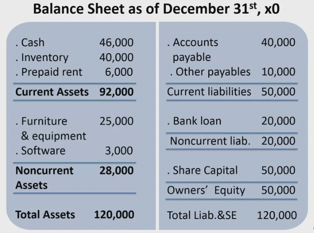

# Principles of Accounting

These are my notes on the Coursera course [Accounting: Principles of Financial Accounting](https://www.coursera.org/learn/financial-accounting?specialization=foundations-management), taught by Prof. Marc Badia.

The course explains in 4 weeks the 3 most important finance reports (balance, income, cash-flow) and explains additionally accrual accounting.

Overview:
1. Introduction
2. The Balance Sheet
   - The Bookstore Case
   - Double Entry Accounting
   - The Balance Sheet
   - Interpretation of the Balance Sheet
   - Assets
   - Liabilities
   - Readings: Notes
   - Translation & Further Notes
3. The Income Statement
4. The Cash Flow Statement
5. Accrual Accounting

## 1. Introduction

Accounting is known as "the language of business".

The companz managers are the ones which record all economic events and transactions according to some standards and present it to interested parties. These interested parties are many:
- Current shareholders
- Potential shareholders
- Own comany workers who would like to negotiate their salary
- Customers who look for long-term product support
- Competitors
- ...

There is a conflict of interest: the company managers prepare the accounting reports and these are incentivized if the company shows to performs well; therefore, it is in their favor to show good reports. Hence, external auditors are required to supervise and certify that the reports are correct.

## 2. The Balance Sheet
### 2.1. Bookstore Case

We have the following case, taken from the PDF downloaded from the course:

1. On December 1st, Cristina incorporates the Campus Bookstore and together with her uncle, they contribute €50,000 of capital to the business.
2. Cristina negotiates a loan with the bank. On December 31st, the Campus Bookstore receives a three-year bank loan of €20,000. The full amount of the principal has to be repaid at the end of the third year.
3. On December 31st, the Campus Bookstore purchases furniture and equipment for €25,000 (€15,000 paid in cash and the rest to be paid in the coming year).
4. On December 31st, the Campus Bookstore acquires a bookstore management software for €3,000 paid in cash.
5. On December 15th, the Campus Bookstore purchases books on credit for a total amount of €40,000.
6. On December 31st, Cristina signs a one-year lease for the premises of the Campus Bookstore. The lease will start on January 1st and will end on December 31st of year x1. The Campus Bookstore prepays €6,000 for the full year rent.

Every business has a business cycle:

Cristina, the bookstore owner says she has all the receipts of the payments she's done.
However, keeping track of all the payment receipts is not enough, because

- it does not reflect the full value of assets, only what has been paid for in cash
- it does not include how much money is owed
- it doesn't specify where the money is coming from (sources of capital)

### 2.2. Double Entry Accounting

In order to overcome the issues or lacks faced by a payments-based accounting, the **double entry accounting** is used in a table with two sides: **(1, right) the sources of capital and (2, left) uses of that capital**.

Main idea: any money entry on the right needs to reflect the use of that money on the left. Each side of the table is divided in different accounts. Thus, for every value transaction, at least 2 accounts need to be updated; however, these not always will be on different sides of the table.

In the following, all the 6 transactions/payments carried out to open the bookstore are reflected in the table and commented:

<!---  -->

If we make the sum of each account and display the summary, we have our **balance sheet**, which is th emost important financial statement:

Note the following points:
- We have created **accounts** on both sides of the table:
  - Cash
  - Inventory
  - Equipment
  - Rent
  - Software
  - Loan
  - Common stock / Share capital
  - ...
- The sum on both sides of the table must be the same
- On entry in an account needs at least another entry in another account, which might be on the same side or on the other side
### 2.3. The Balance Sheet

The two-sided table is **the balance sheet**.
It is the most important financial statement because it shows a complete image of the stat eof the company.
It is also called the **statement of the finance position**.
We can see that the accounts of the balance sheet can be classified in very clear types of accounts:

- Source of money (right): **Assets**
  - **Current liabilities**: liabilities are sources of capital **that we need to return** before the **maturity date**, in the case of current liabilities we need to return them within a year
  - **Noncurrent liabilities**: liabilities that we need to return, but later than within a year
  - **Owner's equity**: sources that we don't need to return
- Use of money (left): **Liabilities and Owner's Equity**
  - **Current assets**: they are cash or they are going to become cash in the near term (months)
  - **Non-current assets**: assets that are not going to become money (in the short run). These are the long-term resources.

The order of the accounts is relevant:

- Anglosaxon style (USA, UK, etc.):
  - Assets: most liquidity on top, less at the bottom
  - Liabilities and owner's equity: closer maturity on top, less or non maturity (no need to return) at the bottom
- Continental European style: opposite order

### 2.4. Interpretation of the Balance Sheet

The different account categories/types are related:

- Non-current assets are our long-term assets; they are related with the long-term liabilities, which are the non-current liabilities and the owner's equity. We check that our long-term resources (28k) can be fully payed by the long-term liabilities (70k); in other words, with the money we do not need to return at least within a year we can assure that our equipment and long-run assets are financed.
- Similarly, we check that our current assets (cash, inventory to be sold shortly, etc.) are able to cover our current liabilities (immediate debts that are to be paid shortly): 92k > 50k.
  - **Working capital** = Current Assets - Current Liabilities.

Thus, we conclude that the status of the bookstore overall is good.

However, there are some unknown points yet:

- Inventory: right now, we have the purchase cost of the goods to be sold;  when are we going to sell the books? at which pace? at which price? will that be enough?
- The company doesn't own buildings/lands, but they rent them. If they owned them, they would have needed much more sources of capital.

### 2.5. Assets

In accounting, an asset is defined by three elements:

1. An asset is a **resource owned or controlled by the firm**. The furniture & equipment are ours.
2. An asset is expected to **generate future economic benefits**.
3. An asset is the **result of a past event or transaction**.

Additionally, we have two conditions to acknowledge an asset:

- The **value needs to be estimated reliably**.
- The future **economic benefits need to have high probability**.

Every time we add an asset we need to check those 3+2 points.
Examples:

- Equipment of 1M euros: fulfills all 5 points
- Diet Coke brand: it is not an asset, because it is nt the result of a past transaction, but an internal creation process.
- Lottery tickets: it is not an asset, because the probability of future benefits is low.
- Employees: they are not assets, because they are not owned by the company! However, there is an exception here: Sports clubs like FC Barcelona. These clubs have often in their assets something called *transfer rights*. A transfer right is tied to a player and it gives the permission to the club so that the player plays with them for a given amount of time. For instance, Suárez went from Liverpool to Barcelona and Barcelona payer the transfer fee to Liverpool for that; as such, that fee is in the assets list, because it fulfills all 5 points. However, Mesi, a Barcelona player discovered brought up and trained within Barcelona, has not a transfer fee within Barcelona assets list, because there is not a past transaction tied to him.

### 2.6. Liabilities

In accounting, a liability is defined by two elements:

1. A liability is a present **obligation of the firm to transfer economic benefits in the future to another party**. Example: a loan.
2. A liability is the **result of a past event or transaction**. The obligation to repay originates from this past transaction.

Additionally, as with assets, we have two conditions to acknowledge a liability:

- The **value transferred (outflow) needs to be estimated/measured reliably**.
- Liabilities need to be **repaid with have high probability**. We have probable outflows of benefits.

Examples:

- A bank loan: it is a clear liability.
- Law suit: a company is likely to lose a law suit, but we cannot estimate the penalty. Since there is no clear estimation, we do not add it to the liabilities, but we disclose it in the footnotes of the balance sheet!
- A company sells cars with 3-year warranties. It is a liability, because the warranty contract fulfills the 4 points; we estimate the amount of warranty contracts which are exercised out of past experience/years. This kind of liabilities for which their amounts need to be predicted in that manner are called **provisions**.

### 2.7 Readings

### 2.8 Translation & Further Notes

