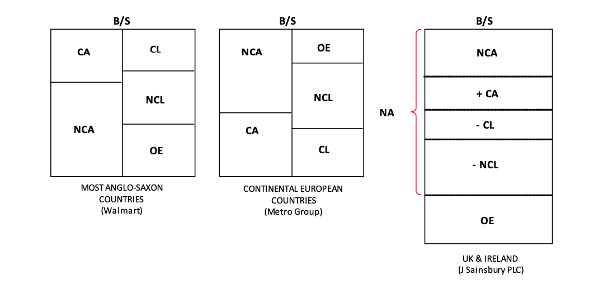

# Principles of Accounting

These are my notes on the Coursera course [Accounting: Principles of Financial Accounting](https://www.coursera.org/learn/financial-accounting?specialization=foundations-management), taught by Prof. Marc Badia.

The course explains in 4 weeks the 3 most important finance reports (balance, income, cash-flow) and explains additionally accrual accounting.

Overview:
1. Introduction
2. The Balance Sheet
   - 2.1 The Bookstore Case
   - 2.2 Double Entry Accounting
   - 2.3 The Balance Sheet
   - 2.4 Interpretation of the Balance Sheet
   - 2.5 Assets
     - 2.5.1 Most Common Assets (from the readings)
   - 2.6 Liabilities
     - 2.6.1 Most Common Liabilities (from the readings)
   - 2.7 Owners' Equity (OE) (extra, after the readings)
     - 2.7.1 Most Common Owners' Equity
   - 2.8 Readings: Notes
     - `Accounting_01_Introduction.pdf` (p. 1-11)
     - `Accounting_02_BalanceSheet.pdf`
   - 2.9 Balance Sheet: Summary of Accounts
     - `Accounting_BalanceSheet_Accounts_Summary.pdf`
   - 2.10 Bookstore Case: Further Transactions
   - 2.11 Translation & Further Notes
     - `Contabilidad_01_Introduccion.pdf`
     - `Contabilitdad_02_BalanceSituacion.pdf`
3. The Income Statement
   - 3.1 Example with the Bookstore Case
   - 3.2 Readings: Notes
     - `Accounting_01_Introduction.pdf` (p. 11-15)
     - `Accounting_03_IncomeStatement.pdf`
       - Classification of expenses
       - Recognition of revenues and expenses
       - Other Comprehensve Income (OCI)
       - Earnings per Share (EPS)
       - Examples of Income Statements
   - 3.3 Translation & Further Notes
     - `Contabilidad_01_Introduccion.pdf`
     - `Contabilitdad_03_CuentaResultados.pdf`
4. The Cash Flow Statement
5. Accrual Accounting

## 1. Introduction

Accounting is known as "the language of business".

The company managers are the ones which record all economic events and transactions according to some standards and present it to interested parties. These interested parties are many:
- Current shareholders
- Potential shareholders
- Own company workers who would like to negotiate their salary
- Customers who look for long-term product support
- Competitors
- ...

There is a conflict of interest: the company managers prepare the accounting reports and these are incentivized if the company shows to performs well; therefore, it is in their favor to show good reports. Hence, external auditors are required to supervise and certify that the reports are correct.

## 2. The Balance Sheet
### 2.1. Bookstore Case

We have the following case, taken from the PDF downloaded from the course:

1. On December 1st, Cristina incorporates the Campus Bookstore and together with her uncle, they contribute €50,000 of capital to the business.
2. Cristina negotiates a loan with the bank. On December 31st, the Campus Bookstore receives a three-year bank loan of €20,000. The full amount of the principal has to be repaid at the end of the third year.
3. On December 31st, the Campus Bookstore purchases furniture and equipment for €25,000 (€15,000 paid in cash and the rest to be paid in the coming year).
4. On December 31st, the Campus Bookstore acquires a bookstore management software for €3,000 paid in cash.
5. On December 15th, the Campus Bookstore purchases books on credit for a total amount of €40,000.
6. On December 31st, Cristina signs a one-year lease for the premises of the Campus Bookstore. The lease will start on January 1st and will end on December 31st of year x1. The Campus Bookstore prepays €6,000 for the full year rent.

Every business has a business cycle:

Cristina, the bookstore owner says she has all the receipts of the payments she's done.
However, keeping track of all the payment receipts is not enough, because

- it does not reflect the full value of assets, only what has been paid for in cash
- it does not include how much money is owed
- it doesn't specify where the money is coming from (sources of capital)

### 2.2. Double Entry Accounting

In order to overcome the issues or lacks faced by a payments-based accounting, the **double entry accounting** is used in a table with two sides: **(1, right) the sources of capital and (2, left) uses of that capital**.

Main idea: any money entry on the right needs to reflect the use of that money on the left. Each side of the table is divided in different accounts. Thus, for every value transaction, at least 2 accounts need to be updated; however, these not always will be on different sides of the table.

In the following, all the 6 transactions/payments carried out to open the bookstore are reflected in the table and commented:

<!---  -->

If we make the sum of each account and display the summary, we have our **balance sheet**, which is th emost important financial statement:

Note the following points:
- We have created **accounts** on both sides of the table:
  - Cash
  - Inventory
  - Equipment
  - Rent
  - Software
  - Loan
  - Common stock / Share capital
  - ...
- The sum on both sides of the table must be the same
- On entry in an account needs at least another entry in another account, which might be on the same side or on the other side
### 2.3. The Balance Sheet

The two-sided table is **the balance sheet**.
It is the most important financial statement because it shows a complete image of the state of the company.
It is also called the **statement of the finance position**.
We can see that the accounts of the balance sheet can be classified in very clear types of accounts:

- Source of money (right): **Liabilities and Owner's Equity**
  - **Current liabilities (CL)**: liabilities are sources of capital **that we need to return** before the **maturity date**, in the case of current liabilities we often need to return them within a year
  - **Non-current liabilities (NCL)**: liabilities that we need to return, but later than within a year
  - **Owner's equity (OE)**: sources that we don't need to return
- Use of money (left): **Assets**
  - **Current assets (CA)**: they are cash or they are going to become cash in the near term (months)
  - **Non-current assets (NCA)**: assets that are not going to become money (in the short run). These are the long-term resources.

**Accounting identity**: `A = L + OE`
**Net Assets**: `NA = A - L = CA + NCA - CL - NCL =  OE`

Note on the current liabilities/assets: *current* refers often to the next 12 months, but it can be longer if the business' operating cycle is longer (e.g., a winery, which needs 2 years to produce wine). Additionally, we might have liabilities/assets that are due in the short-term (months/weeks) not in 12 months.

Valuation can be:
- Historical cost: the value at purchase time
- Current value: aka fair or market value, the present cost if sold

Usually, historical costs are registered in the balance sheet, but recently the use of current value has extended; it has pros and cons.

The order of the accounts is relevant:

- Anglosaxon style (USA):
  - Assets: most liquidity on top, less at the bottom
  - Liabilities and owner's equity: closer maturity on top, less or non maturity (no need to return) at the bottom
- Continental European style: opposite order as USA
- UK & Ireland: one column

### 2.4. Interpretation of the Balance Sheet

The different account categories/types are related:

- Non-current assets are our long-term assets; they are related with the long-term liabilities, which are the non-current liabilities and the owner's equity. We check that our long-term resources (28k) can be fully payed by the long-term liabilities (70k); in other words, with the money we do not need to return at least within a year we can assure that our equipment and long-run assets are financed.
- Similarly, we check that our current assets (cash, inventory to be sold shortly, etc.) are able to cover our current liabilities (immediate debts that are to be paid shortly): 92k > 50k.
  - **Working capital** = Current Assets - Current Liabilities.

Thus, we conclude that the status of the bookstore overall is good.

However, there are some unknown points yet:

- Inventory: right now, we have the purchase cost of the goods to be sold;  when are we going to sell the books? at which pace? at which price? will that be enough?
- The company doesn't own buildings/lands, but they rent them. If they owned them, they would have needed much more sources of capital.

### 2.5. Assets

In accounting, an asset is defined by three elements:

1. An asset is a **resource owned or controlled by the firm**. The furniture & equipment are ours.
2. An asset is expected to **generate future economic benefits**.
3. An asset is the **result of a past event or transaction**.

Additionally, we have two conditions to acknowledge an asset:

- The **value needs to be estimated reliably**.
- The future **economic benefits need to have high probability**.

Every time we add an asset we need to check those 3+2 points. If we have a good which does not fulfill any of the points but is of considerable value, we disclose it in a note. The management needs to address cases of doubt; for instance, we could doubt whether a newly discovered tech is an asset, because its future economic impact is unsure.

Examples of assets:

- Equipment of 1M euros: fulfills all 5 points
- Diet Coke brand: it is not an asset, because it is nt the result of a past transaction, but an internal creation process.
- Lottery tickets: it is not an asset, because the probability of future benefits is low.
- Employees: they are not assets, because they are not owned by the company! However, there is an exception here: Sports clubs like FC Barcelona. These clubs have often in their assets something called *transfer rights*. A transfer right is tied to a player and it gives the permission to the club so that the player plays with them for a given amount of time. For instance, Suárez went from Liverpool to Barcelona and Barcelona payer the transfer fee to Liverpool for that; as such, that fee is in the assets list, because it fulfills all 5 points. However, Mesi, a Barcelona player discovered brought up and trained within Barcelona, has not a transfer fee within Barcelona assets list, because there is not a past transaction tied to him.

#### 2.5.1 Most Common Assets (from the readings)

**Current Assets**:
- Cash: the most liquid asset
- Short-term investments (bonds, shares, etc.)
- Account receivable: amounts owed by customers
- Inventories: purchased products, held for sale. Manufacturing companies have three types
  1. Raw materials
  2. Work in progress inventory: products in production
  3. Finished inventory: products for sale
- Prepaid expenses: insurance, rent, etc.
- Interest receivable: interest earned, not yet received
- Taxes receivable: taxes not yet refunded
- Non-current assets held for sale (they become current assets)

**Non-Current Assets**:
- Property, plant, equipment (inmobilizado material): land, buildings, machines, vehicles, etc. (tools that are not intended for sell, but for doing business). Noten that the same thing could be considered current/non-current for different companies. Often times the (accumulated) depreciation is added in the summary balance sheet below the property/equipment account.
- Deferred tax assets: income taxes recoverable in the future, later than in a year
- Intangible assets: patents, trademarks, copyrights; amortization is needed (amotization = depreciation for intangile assets).
- Financial investments
- Goodwill: value that arises when a firm acquires another firm: growth opportunities, know-how, etc. No amortization is done, but impairment test can be done if the Goodwill has lost its value.

### 2.6. Liabilities

In accounting, a liability is defined by two elements:

1. A liability is a present **obligation of the firm to transfer economic benefits in the future to another party**. Example: a loan.
2. A liability is the **result of a past event or transaction**. The obligation to repay originates from this past transaction.
3. The settlement which is expected will **cause an outflow of economic benefit**.

Additionally, as with assets, we have two conditions to acknowledge a liability:

- The **value transferred (outflow) needs to be estimated/measured reliably**.
- Liabilities need to be **repaid with have high probability**. We have probable outflows of benefits.

As with the assets, if we have a possible liability which does not fulfill any of the points, it is not considered a liability; however, it is disclosed if it has a considerable value.

Examples:

- A bank loan: it is a clear liability.
- Law suit: a company is likely to lose a law suit, but we cannot estimate the penalty. Since there is no clear estimation, we do not add it to the liabilities, but we disclose it in the footnotes of the balance sheet!
- A company sells cars with 3-year warranties. It is a liability, because the warranty contract fulfills the 4 points; we estimate the amount of warranty contracts which are exercised out of past experience/years. This kind of liabilities for which their amounts need to be predicted in that manner are called **provisions**.
- Future salaries: they are not liabilities, because they are future obligations or commitments for work that has not been done yet.

#### 2.6.1 Most Common Liabilities (from the readings)

**Current Liabilities:**
- Accounts payable: amounts owed to suppliers, etc.
- Salaries, Utilities payable, Interest payable; also known as accrued expenses
- Advances from customers, Deferred/Unearned revenue: goods or services not yet delivered
- Short-term, loans
- Notes payable: like accounts payable, but formalized with contacts (and often with interest).
- Provisions: liabilities for which value/cost and maturity are unknown, e.g., costs for warranty repairs
- Current portion of long-term loans: the part of a loan that needs to be repaid regularly (not the interest), e.g., the monthly mortgage fee - interests.

**Non-Current Liabilities:**
- Long-term loans, mortgages
- Pension obligations: payable when employees retire
- Provisions for restructuring costs
- Provisions for legal issues  litigation
- Capital lease obligations: amounts owed because of renting stuff
- Deferred tax liabilities: income tax payable in the future

### 2.7 Owners' Equity (extra, after the readings)

The Owners' Equity is the wealth of the owners of the firm. Two parts:
- Capital contributed by them
- Earnings generated by the operations and retained in the firm

It is often derived from the accounting identity:

`OE = A - L`

#### 2.7.1 Most Common Owners' Equity

- Share capital / Common stock: par or nominal value x number of shares; the nominal value is an arbitrary value that does not need to be the value paid by investors. If the company is not in the markets, the share capital is the money put by the investors, often the founders.
- Share premium or Additional paid in capital: price in excess of the nominal values which reaches the total price paid for each share by market investors.
- Preferred shares / stock: shares with additional voting rights
- Retained earnings / profits: earnings of current and past periods not distributed to owners
- Accummulated other comprehensive income / Reserves: gains or losses in addition to the retained earning, for instance when financial assets increase in value
- Non-controlling interests: equity interests of minority shareholders in companies controlled by the firm

### 2.8 Readings

#### 2.8.1 `Accounting_01_Introduction.pdf` (p. 1-15)

**Very important case study** in which the balance sheet is built with much more transactions as in the videos.

General notes:

- Managerial accounting vs financial accounting: first for inside firm, second for interested parties outside the company
- Annual report: summary of yearly financial status, public, audited, for for interested parties outside the company
- Balance sheet
  - Sources of capital (right)
    - Liabilties: `L`: current and non-current
    - Owners' equity: `OE`
  - Use of capital (left)
    - Assets: `A`: current and non-current
- Accounting idetity: `A = L + OE`
  - Or: `OE = A - L`: owned wealth is the residual after we substract to our resources the funds we need to return
  - `A - L = OE = NA`: aka net assets

**Case study:** DSJ company creation and operations over time (**very complete introductory example**):

- Usually, the balance sheet is presented every year or quarterly; therefore, we add an account in OE called **profit of the period**, which accounts for the revenues and expenses (i.e., profits).
- The balance sheet contains a summary of all transactions.
- When we pay the rent for a given time frame, this reduces the **cash** (assets), but it increases the account **prepaid rent** (assets), as the physical place is a resource we use!
- When we **sell** merchandise/goods, the revenues go to the account **profit of the period** (OE), and several things happen additionally:
  - If we sell merchandise/goods in cash, the received money goes to the cash account (assets).
  - If we sell on credit its value goes to an assets account called **accounts receivable** (in assets), not to the cash account; this way, it is clear we do not have the money yet.
  - Additionally we need to reflect the **costs of goods sold** (COGS) to keep a balance in the balance sheet: the **inventory** account (assets) needs to be decreased in the value of the associated cost and the **profit of the period** (OE) also decreased by the costs; this way, we have the real profits in the account **profit of the period**, not the revenue!
  - These steps are done often in separate entries because receiving the money and delivering the goods are separate events, and the amount of capital **in** the company is better portrayed that way.
- When we sell goods but we deliver them later, the revenues do not go to the **profits** account!
  - We register the increase in cash (assets).
  - We open/register the account **deposits from customers/unearned renevue** (liabilities).
- The contributed capital and the earned capital need to be well distinguished in the OE section.
- Expenses, if not tied to other assets, cause a decrease in two accounts
    1. **cash**
    2. **profit of the period**: here we usually add a note to the type of expense
- Updates of assets in the period:
  - Equipment: Depreciation of equipment is registered as an expense. Usually, the monthly fee is: `cost / useful life expentancy in months`; then we multiply it by the months in the period (usually 3 months, i.e., a quarter). Often the summary balance sheet contains an entry with the accumulated depreciation below the equipment cost value.
  - Prepaid rents: if we have a prepair rent for 6 months, this is reflected as an asset; however, after 3 months (period), its value has halved, and wee need to reflect it in two accounts
    1. prepaid rent (assets)
    2. profit
- Interests and Taxes to be payed
  - Even though interests and taxes can be required to be paid at year end, every period we need to account for them and change two accounts:
  1. **interests payable** / **taxes payable** (liabilities)
  2. profit (OE)
  - This is another example in which the recognition of an expense does not require cash outflow!

Usually balance sheets are presented in two consecutive periods to analyze the development.

#### 2.8.2 `Accounting_02_BalanceSheet.pdf`

All new concepts are integrated in the notes above.
The PDF provides three interesting real-life examples of balance sheets, each in one of the formats (Anglosaxon, European, UK):
- Walmart Stores
- Metro Group
- J Salisbury plc

Have a look at them!!

### 2.9 Balance Sheet: Summary of Accounts

See the collocated PDF

`Accounting_BalanceSheet_Accounts_Summary.pdf`

A very nice summary of most common accounts in each of the `A`, `L` and `OE` groups is provided.

### 2.10 Bookstore Case: Further Transactions in the Next (Second) Year

1. Purchase of books on credit for €130,000.
   - Accounts payable (L): +€130,000
   - Inventory (A): +€130,000
2. The Campus Bookstore sells books to individual customers who pay in cash. During x1, the total amount of cash sales is €120,000. The books sold in cash have a total purchase cost of €80,000.
   - Profit & Loss (OE) (Revenues - Expenses): +€120,000 (revenue) -80,000€ (expense)
   - Cash (A): +€120,000
   - Inventory (A): -80,000€
3. The Campus Bookstore sells books on credit to the school and other corporate customers. During x1, the total amount of credit sales is €60,000. The cost of the books sold on credit is €45,000.
   - Profit & Loss (OE): +€60,000 (revenue) -€45,000 
   - Accounts receivable (A): +€60,000
   - Inventory (A): -€45,000
   - **Important note**: **liquidity** and **profitability** are not the same! In this case, we have profitablity, but the profit is allocated in the account "Accounts Receivable", i.e., we don't have the money yet. Being liquid means we have cash we can use right away.
4. The Campus Bookstore pays €30,000 in cash for the selling, general and administrative costs incurred in x1. They include Cristina’s salary and utilities.
   - Profit & Loss (OE): -€30,000
   - Cash (A): -€30,000
   - Note that we don't use the "Salaries" account from Liabilities since the payment already took place; I understand that the "Salaries" refers more to payable salaries not paid yet...
5. In x1, the Campus Bookstore incurs in a rent expense of €6,000. This amount was already prepaid at the end of year x0.
   - The idea is we have an Asset account related to the prepaid rent; at the end of the year we need to decrease it; and we need to recognize we're poorer also
   - Prepaid rent (A): -6,000€
   - Profit & Loss (OE): -6,000€
6. On December 31st of x1, the Campus Bookstore prepays €6,600 for the rent of year x2.
   - Prepaid rent (A): +6,600€
   - Cash (A): -6,600€
7. The cash collected from credit sales is €38,000.
   - Cash (A): +€38,000
   - Accounts Receivable (A): -€38,000
   - Here we see that we are more liquid (because cash increased) but not more profitable, because the profits did not change!
8. The Campus Bookstore pays €10,000 to furniture and equipment suppliers, cancelling the pending obligation.
   - Cash (A): -€10,000
   - Accounts Payable, Others Payable (L): -€10,000
9. The Bookstore pays to the suppliers of the books the pending receipt of €125,000
   - Cash (A): -€125,000
   - Accounts Payable (L): -€125,000
10. The Campus Bookstore recognizes the depreciation of furniture and equipment in x1. The original purchase cost of furniture and equipment was €25,000. Cristina estimated a useful life of five years and no salvage value for this asset.
    - Accumulated Depreciation (below Furniture asset) (A): -((€25,000 original -0 salvage )/5 years) years of life = -€5,000
    - Profit & Loss (OE): -€5,000
      - Depreciation: for tangible non-current assets (always applied to NCA)
      - Amortization: for intangible non-current assets (always applied to NCA)
11. The Campus Bookstore recognizes the amortization of the software in x1. The original purchase cost of the software was €3,000. Cristina estimated a useful life of three years and no salvage value for this intangible asset.
    - Accumulated Amortization (A): - (3000 - 0) / 3 = -€1,000
    - Profit & Loss (OE): -€1,000
12.  At the end of x1, the Campus Bookstore recognizes and pays the interest cost on the bank loan. The bank charges an interest of 5% for the €20,000 loan, that is, €1,000.
    - Cash (A): - 0.05 * 20,000 = - €1,000
    - Profit & Loss: -€1,000 (interest expense)
    - Note that this transaction refers only to the interest; we are not returning principal, only paying the interest
13.  In x1, the Campus Bookstore makes a profit before taxes of €12,000 and recognizes corporate taxes of €3,600 (i.e. 30% x 12,000). This amount will be paid later in x2 when the tax forms are filed.
     - Taxes Payable (L): €3,600
     - Profit & Loss / Retained Profits (OE): -€3,600

#### Closing the year in the Belance Sheet

At the end of the year, we move the amount in the **Profit & Loss** (OE) account to the account **Retained Profits** (OE); if no such account exists, we open it.

- Profit & Loss (P/L) contains the profits of accumulated during the year and it is set to 0 at the end, to start the new year
- Retained Profits contains all profits accumulated during the existence of the company
- Having two different accounts makes possible to better evaluate the company: this year and its history.

Interpretation of the Balance Sheet at the year end (always in comparison to previous year, compute percentage changes):
- We have enough cash + A/R (accounts receivable) to pay the current liabilities within a year.
- The bank loan is a future obligation, not for the short-term.
- Our non-current assets are decreasing due to depreciation/amortization, but we have still several years until the value is completely lost.
- The OE has increased: we increased the retained profits; however, our cash has decreased. Thus, we are more profitable, but less liquid.

#### My Notes

- **Liquidity and profitability** are decoupled:
  - Liquidity refers to Cash (A)
  - Profitability refers to Profit & Loss (OE)
  - We can sell goods on credit (Accounts Receivable): our profit increase, but not our cash, because we need to wait for the maturity of the delayed payment
- The account **Profit & Loss** from OE is very important: every time we are unsure, we ask whether *the owners got richer/poorer* and if there is a clear answer, we change the **Profit & Loss** account. **Revenues** and **Expenses** that modify the effective wealth of the owners go here!
  - Every time we have a **profit** or an **expense** which is not reflected in any other account to balance the counterpart entry, we need to add here the profit or expense line!
- **Depreciation and Amortization** apply always to Non-Current Assets
  - Depreciation is for tangible assets and Amortization for intangible ones
  - We need to define three components for the computation
    - Useful life of the asset, e.g. 5 years
    - Salvage value (value after useful life), e.g., 0
    - Method of depreciation, e.g. straight line (linear)
  - Computation (linear method): (acquisition value - salvage value) / years of useful life
  - And we modify two accounts
    - Accumulated Depreciation: right below the asset acquisition value which is depreciated
    - Profit & Loss: because we become poorer
  - We call the **net book value** of an asset its acquisition value minus the accumulated depreciation/amortization

### 2.11 Translation & Further Notes

I made this transactions into Spanish whilea skimming through the Spanish version of the Specialization, also available on Coursera.
There are also readings in Spanish:

#### `Contabilidad_01_Introduccion.pdf`

- Cash = caja
- Creditors = Acreedores: bancos, proveedores, etc.
- Share capital (EU) = Capital stock (USA) = capital social: capital put by founders or shareholders
- Balance sheet = balance de situación: financial state at a point in time
- Assets = Activo
- Liabilities = pasivo: funds we need to return
- Owners'/Shareholders' equity = patrimonio neto
- Equipment = inmobilizado material
- (Merchandise) inventory = Existencias
- Accounts payable = cuentas a pagar: when we get merchandise or similar on credit, i.e., we have not payed yet, but we need to pay it gradully in time
- Gross profit = beneficio bruto
- Profits/Earnings = renevues - expenses
- Beneficio/Ganancias = ingresos - gastos
- Accounts receivable = cuentas por cobrar
- Profit of the period = resultado del periodo
- Cost of goods sold (COGS) = Coste de mercancías vendidas (CMV)
- Deposits from cutomers / unearned renevues = Anticipos de clientes / ingresos no devengados
- Depreciation expense of equipment = amortización
- Amortization = amortización de intangibles
- Income tax = Impuesto de sociedades
- Income statement = cuenta de resultados, cuenta de pérdidas y ganancias
  - Gross profit = beneficio bruto
  - Operating profit = Resultado de explotación
  - Profit before tax = Beneficio antes de impuestos
  - Net profit = Beneficio neto
- Current and non-current assets = Activos corrientes y no corrientes
- Current and non-current liabilities = Pasivo corrientes y no corrientes
- Profit margin = margen neto
- Return on equity = rentabilidad sobre recursos propios
- Goodwill = fondo de comercio de sociedades consolidadas
- Capital lease obligations = acreedores por arendamientos financieros
- Share premium or Additional paid in capital = Prima de emisión
- Non-controlling interests = Participaciones no dominantes

#### `Contabilitdad_01_BalanceSituacion.pdf`

All translated terms are above.

## 3. The Income Statement

### 3.1 Example with the Bookstore Case

This section continues with the state of the balance sheet after the second year (see Section 2.10).

The most important accounts for the shareholders are two: 
- Cash: it's related to the liquidity the company has
- Profit & Loss (or Retained Profits, when closing the year): it's related to the profitability of the company

Recall that these two accounts are not necessarily coupled!

Due to their importance, each of these accounts has its own financial statement:
- The Cashflow statement (analyzed in later sections)
- The Income Statement of the Statement of Profit and Loss

The **income statement** gives an overview of how we are incrementing the OE with the operations of the company.
To prepare the **income statement** all **revenues** and **expenses** during the year are listed and grouped in categories.

- Sum of all sales
- Sum of the Costs of Goods Sold: COGS
- Sum of all other expenses: Selling and General Admin expenses: SG&A (salaries, utilities, rent, etc.)
- Sum of all depreciation and amortization expenses
- Sum of all financial expenses (bank loan interests, etc.)
- Sum of all taxes

Then, we compute
- Gross margin = Sales - COGS; we can compare it to other competitors
- EBITDA = Gross margin - SG&A (Earnings before interest and taxes depreciation and amortization)
- EBIT = Operating Profit = EBITDA - Depreciation & Amortization (Earnings before interest and taxes)
- Profit before taxes = EBIT - financial/interest expenses
- Net profit = Profit before taxes - Taxes

After computing the income statement, we compute some ratios in orther to evaluate the operations:

- Return on sales = Net Profit / Sales: 8,400 / 180,000 = 4.7%
- Return on Equity = Net Profit / OE: 8,400 / 50,000 = 16.8%
  - The profit as the percentage of the investment
  - An alternative is to use the average OE during the year in the denominator.

We need to compare those ratios to previous years and other similar companies!

### 3.2 Readings: Notes

#### `Accounting_01_Introduction.pdf` (p. 11-15)

At the end of the fiscal year/period , the amount in the OE account **profit & losses (of the period)** (P/L) is transferred to the OE account **retained profits**, which contains all retained profits during the company's history.
P/L is a very important account, since it summarizes how well the company did in the period! Since it is very important, a new table/statement is created for it: **The Income Statement** or **Profit & Loss account (P & L)**. This table is basically the list of all transactions (or groups of transactions) in the account **profit of the period**. The order matters: revenues are decreased from most basic expenses to taxes until we get the net profit:

1. **Sales revenue**: everything we have earned
2. **Gross profit** = sales revenue - COGS expenses
3. **Operating profit** = Gross profit - operation expenses
   - Operation expenses: salaries, depreciation, rent, etc.
4. **Profit before income tax** = Operating profit - interest expenses
5. **Net profit** = Profit before income tax - income tax
   - Income tax (= impuesto de sociedades) is applied on the profits after all expenses except the taxes; it is different for each countries, and it varies depending on the size and activities of the company

Note that the shareholders can obtain **dividends** from the **net profit**.
Since the dividends are not an expense, they do not appear in the income statement; however, they are reflected in the balance sheet, because they are part of the financial image of the company: **Cash** (assets) and **Profit of the period / Retained profit** are decreased with the amount payed in dividends.

That explains why **profit of the period** is renamed to **retained profits** in the income statement: the income statement accounts for the profits generated (revenues - expenses), independently of how they are distributed.

How a basic financial analysis is done:
- Check **balance sheet**
  - How big is the net profit?
  - How are `A`, `L` and `OE` distributed?
  - Do current assets pay the current liabilities?
    - If our cash is able to pay all current liabilities, that's perfect; but not necessary
    - Same question is applied to non-current assets vs liabilities
- Check the **income statement**
  - How was the net profit obtained?
  - `Profit margin = Net profit / Sales`: how big is it?
  - `Return on equity (ROE) = Net profit / OE`: how big is it? (4x for annualized return)

#### `Accounting_03_IncomeStatement.pdf`

- The income statement relates to a period of time (often a year).
- Note that **revenues are not cash inflows** and **expenses are not cash outflows**; therefore, the net frofit obtained in the income statement is not the change in cash in the period analyzed.
  - The reason is that transactions such as sales on credit are considered assets, even though there is no cash involved.
- Operation expenses are separated because operations could change more rapidly than the costs related to goods sold

##### Classification of Expenses

See tables below.

Two ways of reporting expenses:

1. By the Function related to the expenses
   - Gross profit is computed
   - Common in Anglo-Saxon countries; companies are switching to this format because the gross profit is computed
   - Note that salaries, utilities, materials, etc. are note reported separately; instead, the proportions of them are alloccated to the different functions.

2. By the Nature of the expenses
   - Gross profit is not computed
   - Here, for instance, we cannot tell how much material costs are due to production, research, administration, etc.
   - The same applied to salaries
   - More common in continental Europe

##### Recognition of Revenues and Expenses

Not anything can appear as revenue or expense in the income statement.

- Revenues are recognized if
  - the company has delivered the goods/services promised
  - the company has received cash or some other convertible to cash
- Expenses are recognized if either of these happens:
  - The consumption of an asset (expense) matches with a revenue obtained from that consumption (= matching principle)
  - The consumption of an asset (expense) results from the passage of time (depreciation, interest)

##### Other Comprehensive Income (OCI)

The non-recognizes revenues and expenses that arise from changes in value of assets (not from transactions) are included in an OE account called **accumulated other comprehensive income**. Examples of items include: benefits from pensions, currency translations, derivatives, etc.

That account might be appended explicitly to the net income at the end; in other cases, another separate statement is done, called **statement of comprehensive income**.

##### Earnings per Share (EPS)

At the end, the net profit is divided by the number of shares -- very important indicator.
Note that:
- A weighted average might be used to compute the number of shares, because the real number might vary in the period if more are issued
- Two ways of reporting: basic and diluted; diluted refers to the effects due to the conversion to shares of some financial instruments, such as stock options.

##### Examples of Income Statements

- The Linde Group
- Air Liquide
- Air Products and Chemicals, Inc.

### 3.3 Translation & Further Notes

#### `Contabilidad_01_Introduccion.pdf`

All transalted terms are below.
#### `Contabilitdad_03_CuentaResultados.pdf`

- Income statement = cuenta de resultados
- Revenue = ingreso
- Expense = gasto
- Profit = beneficio
- Gross profit = beneficio bruto
- EBIT = Earnings before interest and taxes = BAII = Beneficios antes de intereses e impuestos
- Other Comprehensive Income = Resultado Integral
- Statement of comprehensive income = Estado de resultado integral
- Earnings per Share = Beneficio por Acción (BPA)
- Matching principle = principio de correlación de ingresos y gastos

## 4. The Cash Flow Statement

### 4.1 T-Accounts and Journal Entries

T-Accounts are a simple way of recording and accumulating the transactions in an account in an orderly manner. They have two sides, one for the increases in the account, the other for the decreases in the account. Each account, no matter in which group (`A`, `L`, `OE`), has its own T-account.

Always, no matter `A`, `L`, `OE`:
- Left side is Debit = Dr. (Debere)
- Right side is Credit = Cr. (Credere)

**Do not try to look into meannings of Debit and Credit: it is just left and right!**

Now, for assets `A`:
- Increases are on the left, Debit
- Decreases are on the right, Credit

For liabilities `L` & owners' equity `OE`, it is the other way around:
- Increases are on the right, Credit
- Decreases are on the left, Debit

Then, the idea is that we register any transaction on the correct side of each account. At the end of the year we sum both sides, apply the rest between the column/side totals, and we have the ending balance of each account!

However, instead of working on the T-accounts, the accountant uses **journal entries**: every transaction is registered in a journal, specifying: accounts involved and the ammounts increased/decreased on their Debit/Credit side. Basaically, the journal entry is done and the software updates the T-accounts!

The T-accounts are called the **ledger**. Now, we know all the elements of the accounting process:
- Record: with journal entries
- Classify: with T-Accounts, that consitute the ledger 
- Summarize: with financial statements (Balance Sheet, Income Statement and Cash Flow Statement)

### 4.2 Campus Bookstore Example: New Transactions Registered in T-Accounts & Balance Sheet

The transactions for period x2 (also available in PDF form: `./Acccounting_Transactions-Week-3.pdf`) are listed below. Relevant comments are done below each transaction. After the list, an image is added with the transactions allocated to T-accounts.

1. Purchase of books on credit for €150,000.
2. The cash sales of books are €140,000. The cost of books sold in cash is €98,000.
3. Sales on credit amount to €70,000. The cost of books sold on credit is €50,000.
4. Collections from credit sales to customers are €64,000.
5. Payments to suppliers of books are €155,000.
6. Selling, general and administrative costs amount to €37,000, all paid in cash.
7. The Campus Bookstore recognizes the rent expense of €6,600. This amount was prepaid at the end of x1.
8. On December 31st x2, the Campus Bookstore pays €7,200 in advance for the full rent of year x3.

   - Recall that prepaid rents are an asset: we pay for using a good over a period of time!

9.  Cristina has estimated a depreciation expense of €5,000 for furniture and equipment in x2.

    - Recall depreciation (tangigle assets) and amortization (intangible assets) is registered in separate accounts to the asset purcha value to better track the value evolution.
    - Since amprtization and depreciaton are considered assets accounts that reduce asset value, they sit on the credit (right) side; that is why they are called *contra assets*.

10. The estimated amortization of software is €1,000.
11. On December 31st, the Campus Bookstore sells the furniture and equipment for a price of €1,800 in cash. The original cost of the furniture and equipment sold was €5,000 and the accumulated depreciation €2,000.

    -  When a depreciating asset is sold, we need to consider:
       -  Asset/equipment purchase price (asset account)
       -  Its accumulated depreciation at sold time (depreciation account)
       -  Selling price (cash account), which might be different to the purchase - depreciation value, incurring in possible gains or losses (P & L account)
    -  It is common to sell equipment when we want to buy newer one!

12. On December 31st, the Campus Bookstore purchases new furniture and equipment for €6,000 in cash.
13. On December 31st, Cristina decides to invest in Apple shares for a total amount of €15,000.
    
    - Buying stocks opens a new current asset account: **Marketable securities**.
    - It is important to account for the value change of these assets; more on that later in the course.

14. The interest recognized and paid on the bank loan at the end of x2 is €1,000.
15. In x3, the Campus Bookstore will have to repay the principal of the loan. So it reclassifies the €20,000 from the long-term bank loan account to another account in current liabilities.

    - The bank loan was for 3 years, but 2 years have passed, thus, we need to re-classify it as a current lianility
    - Re-classification occurs by closing the old account (Bank loan, debit total: 20k) and opening a new with the amount to be paid: Bank loan current, credit total: 20k.

16. On December 31st x2, the Campus Bookstore receives a new long-term bank loan for €30,000

    - It is common to ask for loans if we want to expand our business: we need financing!

17. Taxes paid are €3,600.
18. The tax expense recognized at the end of x2 is €3,060.

    - Taxes or expenses we will have in the future are registered immediately in accounting
    - Thus, we open (1) a tax/expense payable liability account crediting it and the P & L account is debited immediately also, because we anticipate we're going to be poorer.
    - Later, when we pay the expense/taxes, the cash and expense/tax payable accounts are registered

19. The Campus Bookstore makes the closing entry. The net profit for the year is €7,140

    - Sum the **P & L account**: the total of period x2
    - Debit the **P & L account** with the total P/L of x2 and credit the **Retained profits** account
    - Now, **P & L account** has a **End Balance (EB)** of 0, and the gains are registered together with the accumulated wealth.

20. Cristina and her uncle decide to pay themselves cash dividends of €10,000.

    - Dividends are paid from the **Retained profits**, they're not related to the **P & L account**!
    - Therefore, we credit the Cash account and debit the Retained profits account
    - That means two things
      - We need to have cash to pay them
      - We might pay them even tough we have no profits for the year if we have enough accuulated profits in the past years
    - Dividend payment is usually approved by teh shareholders.

In the following, the transactions allocated to the T-accounts are shown. Each transaction has an identifiable number that matches with the transaction list above. Notes: 

- The first line contains only one side with the **Beginning Balance (BB)**.
- If there is no BB, a `-` is put.
- Left (debit) and right (credit) columns do not need to be related!
- The **Ending Balance (EB)** (of the period) is the sum and difference of both sides of the columns

In the following, the balance sheet of the company at the year end is provided. Recall:
- Assets are ordered from most liquid to least
- Liabilities are ordered from sonnest maturity to latest

As a general interpretation, we see that:
- Current assets (in particular, cash and marketable securities) can pay current liabilities.
- `OE` and `NCL` can replace `NCA`.

### 4.3 Campus Bookstore Example: Income Statement

For the preparation of the Income Statement, all the transactions of the **P & L account** are listed in an analytical way.

Two important indicator must be computed every time (and we need to track them over time), and both are related to the most important value in the income statement, i.e., **the net profit**:

- Return on Sales = `Net Profit` / `Sales`: 3.4% (less than last year)
- Return on Equity = `Net Profit` / `OE`: 12.2% (less than last year)

### 4.4 Campus Bookstore Example: The Cash Flow Statement

Profit if not the same as the change in cash, because cash in/outflows do not match with revenues/expenses. Example transactions that show that:

- We can sell/buy on credit.
- Depreciation does not involve any cash, but it is an expense.

As the income statement focusses on the **Profit and loss account**, the **Cash Flow** focusses on the **Cash account**. The Cash Flow account shows the **capability of the company to generate cash and repay its debt**.

In the **Cash Flow** statement, all cash in and outflows, i.e., all entries from tha Cash T-account, are classified in the three stages of a business cycle: **financing, investing, operations**. Note:

- Cash inflows are on the left (debit) of the cash account, outflows on the right (credit).
- We are interested in the change of cash, thus the begining balance is not considered.
- Cash flow from operations (CFO): all transactions related to the activities related to the revenue creation; as a rule off thumb: cash entries reflected in the P&L account; also interests.
- Cash flow from investing (CFI): entries related to non-current assets, marketable securities, etc.
- Cash flow from financing (CFF): loans, dividends, etc.

Sometimes, it is not that clear where each entry goes, it is more convention-based. However, this formula always holds, obviously:

`Change in Cash = CFO + CFI + CFF`

#### 4.4.1 Interpretation of the Cash Flow and the Income Statement: Profitability & Liquidity

#### 4.4.1 Direct and Indirect Methods for the Computation of the Cash Flow

### Excurs: Notes on the last part of `Accounting_01_Introduction.pdf`

**The Statement of Cash Flows**

Profits and cash are decoupled because not all revenues are cash inflows (e.g. sales on credit) and not all expenses are cash outflows (e.g., acquisitions payable). That is the effect of the **the Accrual Basis of Accounting (= principio de devengo)**: the economic impact of events and transactions is recognized when they occur, not when cash is exchanged!

However, the amount of cash, and thus, the evolution of it, is extremely important for the good operation of the comany; many firms fail because of shortages or bad managing of cash.

Therefore, in addition to the income statement, we need another statement to show the evolution of the cash flows during the period: that is the **Cash Flows Statement** -- in it, the cash generation and consumption for the period is summarized.

The Cash Flows statement can be done in to ways that provide the same result:

1. Direct method: all entries of the Cash account (`A`) are listed in three groups
2. Indirect method: done when there is no access to the Cash account

The Cash Flows Statement with the direct method, three groups of entries in the Cash (`A`) account:

1. Cash from financing activities (= actividades de financiación)
   - Capital contributions by owners (+)
   - Borrowings (+)
   - Repayments of borrowings (-)
   - Payment of dividends (+)
2. Cash from investments activities (= actividades de inversión)
   - Purchases of properties, equipement, etc. (-)
   - Purchases of financial assets (-)
3. Cash from operations activities (= actividades de explotación): Rest
   - Collections from customers (+)
   - Payments to suppliers and employees (salaries) (-)
   - Payments of taxes (-)
   - Payments of operating expenses (rent, insurance, utilities, etc.) (-)
   - Interests (+/-)
   - Collection of dividends (+)

**Accounting Records, T-Accounts and Journal Entries**

Instead of keeping a large table with rows as accounts, usually each account has its own table which is shaped in two columns, with a T-shaped form. Columns are:

- Debit = Debere = Dr. = "to owe" = "deber"; on the **left**
- Credit = Credere =  Cr. = "to entrust" = "haber"; on the **right**

Note:
- "Deber" does not mean the company ows something!
- "Haber" does not mean the company has something!
- "Cargar": when entry in debit ("deber") done
- "Abonar": when entry in credit ("haber") done

Asset accounts:
- Increases in the account are recorded on the left = Increase Debit: +
- Decreses in the account on the right = Decrease Credit: -

Liability and Owners' Equity accounts: the opposite:
- Increases in the account are recorded on the right = Increase Credit: +
- Decreses in the account on the left = Decrease Debit: -

Note that
- Debits increase asset accounts, but decrease liability and OE accounts
- Credits decrease asset accounts, but increase liability and OE accounts

Note also:

Example: we get a loan of 10€, which increases or Cash account (Asset) begining balance (BB) of 12€ to have and ending balance (EB) of 22€; in parallel, the Loan account (Liability) is also modified:

A very complete example is provided for the DSJ company:

Accounting is done in practice using a journal: **journal entries** are done for ach transaction, consisting each entry with 2 or more changes in the debit/credit of 2 or more accounts. The software takes each entry and creates the T-accounts from those entries automatically. Thus: **accounting is simplified to doing correct journal entries, the rest is automatic**.

#### Transalation

- Cash flow statement = estado de flujos de efectivo
- Cash from financing activities = efectivo de actividades de financiación
- Cash from operations activities = efectivo de actividades de explotación
- The Accrual Basis of Accounting = principio de devengo
- T-accounting = cuentas en T
- Journal entries = asientos contables